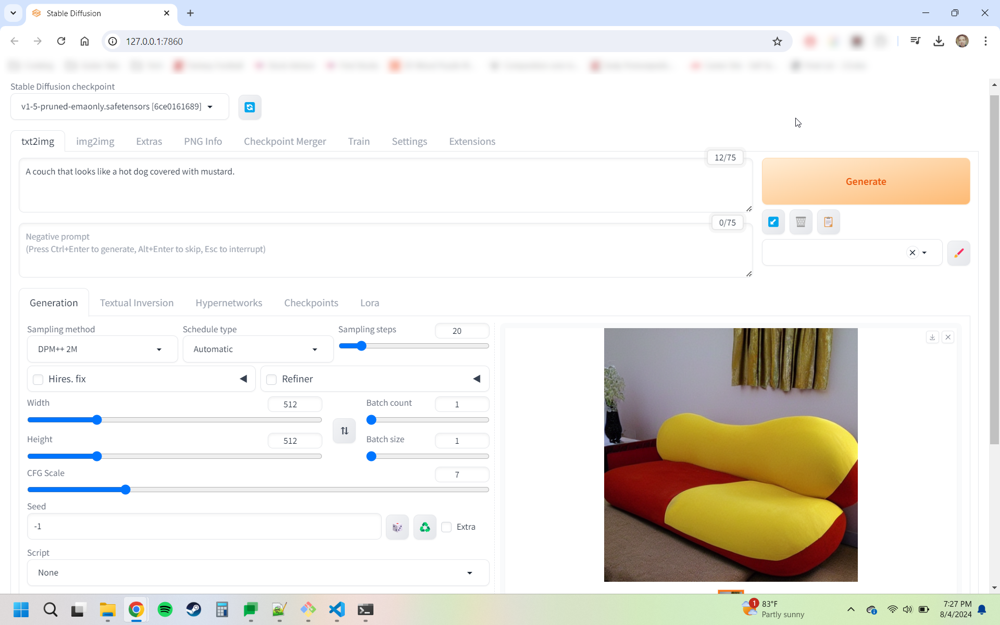

# stable-diffusion-work
Experiments and work with Stable Diffusion.

## Running Stable Diffusion Locally
For reference, I loosely am following this tutorial:

https://www.youtube.com/watch?v=6MeJKnbv1ts

## Install Dependendies
* Install Python: https://www.python.org/downloads/release/python-3106/

## Download the Stable Diffusion Repo
* `git clone https://github.com/AUTOMATIC1111/stable-diffusion-webui.git`

## Modify webui-user.bat
I don't have a GPU on my laptop. So revise the `COMMANDLINE_ARGS` line:
```
set COMMANDLINE_ARGS=--lowvram --precision full --no-half --skip-torch-cuda-test
```

## Run webui-user.bat
The BAT file will open the web browser to a simple web UI. Let's give it a test:

